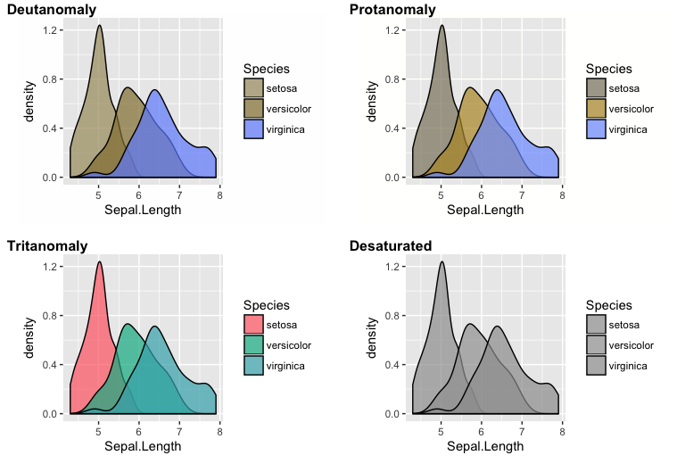

<!-- README.md is generated from README.Rmd. Please edit that file -->
colorblindr
===========

[](https://travis-ci.org/clauswilke/colorblindr) [](https://codecov.io/github/clauswilke/colorblindr?branch=master)

Simulate colorblindness in production-ready R figures. Written by Claire D. McWhite and Claus O. Wilke.

Installation
============

This package depends on the development version of **cowplot** and on a patched version of **colorspace**. Please install those packages first:

    devtools::install_github("wilkelab/cowplot")
    devtools::install_github("clauswilke/colorspace")

Then install **colorblindr**:

    devtools::install_github("clauswilke/colorblindr")

Quick start
===========

Make a figure:

``` r
library(ggplot2)
fig <- ggplot(iris, aes(Sepal.Length, fill = Species)) + geom_density(alpha = 0.7)
fig
```


Now look at it in various color-vision deficiency simulations:

``` r
library(colorblindr)
cvd_grid(fig)
```



Then inspect it in the interactive app:

``` r
view_cvd(p) # starts the interactive app
```
